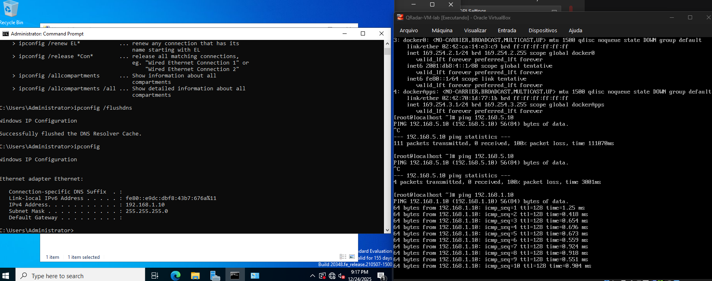
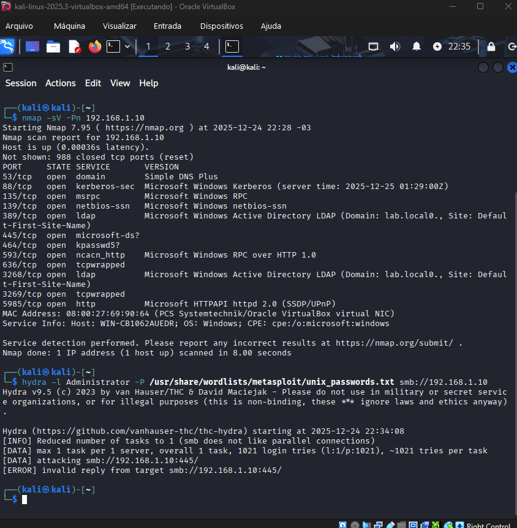
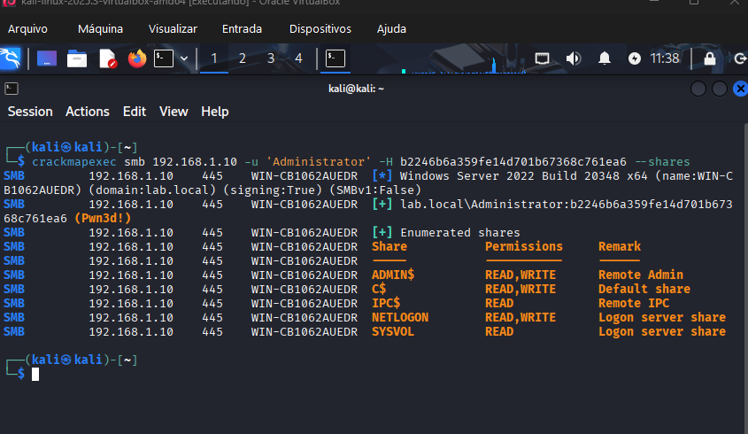
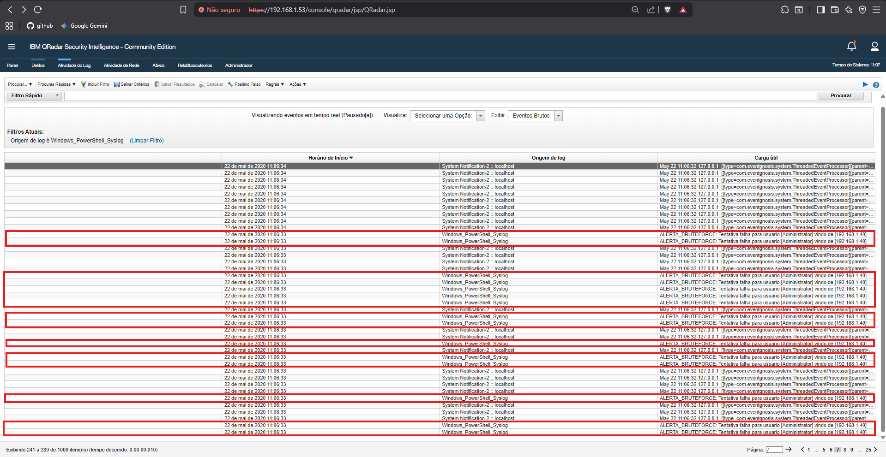
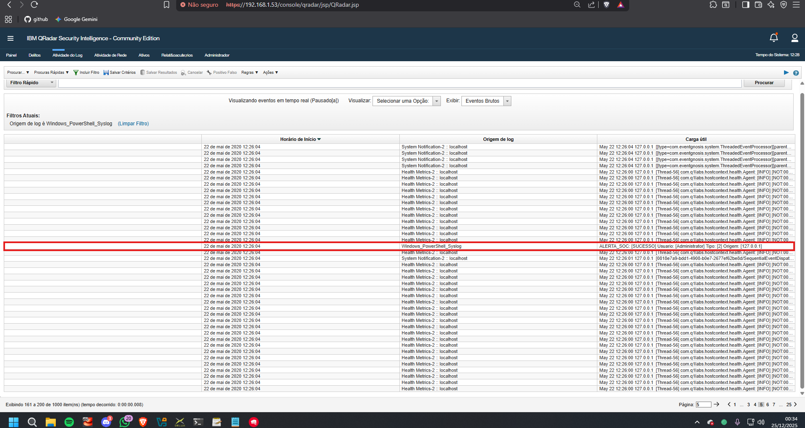

# AD Attack & Defense QRadar Lab 🛡️⚔️

## 🎯 Objetivo Geral
Este projeto tem como finalidade criar uma simulação de um ambiente corporativo real de **Active Directory (AD)** para realizar ataques avançados e elaborar estratégias de **Engenharia de Detecção** em um SIEM (**IBM QRadar**). O objetivo principal é garantir a visibilidade dos logs e superar as limitações de detecção padrão do Windows em ambientes corporativos.

---

## 📚 Aprendizado e Ferramental Técnico
Neste laboratório, o objetivo não foi somente a implementação de ferramentas, mas também a compreensão detalhada de como os protocolos de rede (SMB, NTLM, RPC) funcionam e como eles geram rastros digitais que podem ser utilizados para detecção e resposta a incidentes.

### 🛠️ Ferramentas de Ataque Empregadas
* **Nmap:** Utilizado para descoberta de ativos e enumeração de serviços, identificando portas essenciais para o funcionamento do Active Directory.
* **CrackMapExec (CME):** Ferramenta voltada para testes de segurança em ambientes Windows, empregada na simulação de ataques de força bruta, validação de credenciais e movimentação lateral.
* **Impacket:** Conjunto de classes Python para interação com protocolos de rede, utilizado para manipulação de baixo nível e tentativa de obtenção de credenciais e artefatos sensíveis do sistema.

---

## 🚀 1. Preparação e Configuração (Blue Team)
A infraestrutura foi ajustada previamente para assegurar que todos os eventos e incidentes fossem corretamente centralizados no SIEM antes da simulação do ataque.

*Figura 1: Criação da conta de serviço `qradar_svc` no Active Directory para leitura e coleta de logs.*

*Figura 2: Configuração de IP estático no Domain Controller (192.168.1.10) para garantir estabilidade da infraestrutura.*

*Figura 3: Validação de conectividade entre o atacante, o alvo e o SIEM por meio de testes ICMP.*

---

## ⚔️ 2. Execução do Ataque (Red Team)

### Reconhecimento e Exploração Inicial
A etapa inicial envolveu a identificação de serviços expostos e a simulação de acesso indevido por meio de ataque de força bruta.

*Figura 4: Enumeração de portas críticas como 88 (Kerberos) e 445 (SMB) utilizando o Nmap.*

*Figura 5: Simulação de ataque de dicionário contra o usuário Administrator utilizando o CrackMapExec.*

### Credential Dumping & Movimentação Lateral
Após a obtenção de privilégios administrativos, foi realizado o dumping da base de dados do Active Directory (`NTDS.dit`) e aplicada a técnica de Pass-the-Hash.

*Figura 6: Extração de hashes NTLM de usuários do domínio, incluindo a conta sensível `krbtgt`.*

*Figura 7: Movimentação lateral bem-sucedida por meio da técnica Pass-the-Hash (T1550.002), demonstrando que a complexidade da senha torna-se irrelevante após o comprometimento do hash.*

---

## 🛡️ 3. Detecção e Monitoramento (Blue Team)

### Visibilidade no SIEM
O ambiente de monitoramento foi ajustado para correlacionar falhas e sucessos de autenticação, permitindo a geração de alertas para atividades suspeitas.

*Figura 8: Alerta de tentativa de força bruta detectado e centralizado no console do IBM QRadar.*

*Figura 9: Detecção refinada de autenticação administrativa via rede após a implementação de parser XML customizado em PowerShell.*

---

## 🛠️ 4. Troubleshooting (Desafios Técnicos)

Durante a execução do laboratório, surgiram desafios de infraestrutura e configuração que exigiram intervenção técnica:

* **Time Skew (Sincronização de Tempo):** O Windows Server 2022 recusava autenticações, apresentando o erro `0xc000006d`, devido a uma discrepância de tempo entre o Kali Linux e o Domain Controller. A correção envolveu a desativação da sincronização de hardware no VirtualBox e a configuração manual dos relógios para maio de 2020, mantendo coerência com o licenciamento do SIEM.
* **Caractere Especial na Senha:** O ataque inicial de força bruta não obteve sucesso porque a senha correta era `Doppelganger7&`. A utilização incorreta do caractere final impediu o acesso, evidenciando como pequenas variações impactam diretamente a segurança de contas.
* **Restrições de Administração Remota:** O dumping de credenciais via Impacket foi inicialmente bloqueado por políticas de UAC, exigindo a configuração da chave de registro `LocalAccountTokenFilterPolicy`.
* **Ponto Cego em Logon Type 3:** Foi identificado que logons de rede (Pass-the-Hash) geram eventos com estruturas XML distintas. O script de coleta inicial não processava corretamente esses campos, demandando a reformulação da lógica para realizar o parsing diretamente do objeto XML do evento.

---

## 🎯 Mapeamento MITRE ATT&CK
* **T1046:** Network Service Scanning  
* **T1110.001:** Password Brute Force  
* **T1003.003:** OS Credential Dumping (NTDS)  
* **T1550.002:** Lateral Movement (Pass-the-Hash)

---

📄 Este projeto possui um estudo de caso técnico detalhado em [CASE_TECNICO.md](CASE_TECNICO.md)

*Projeto desenvolvido como parte de estudos em Cibersegurança.*
