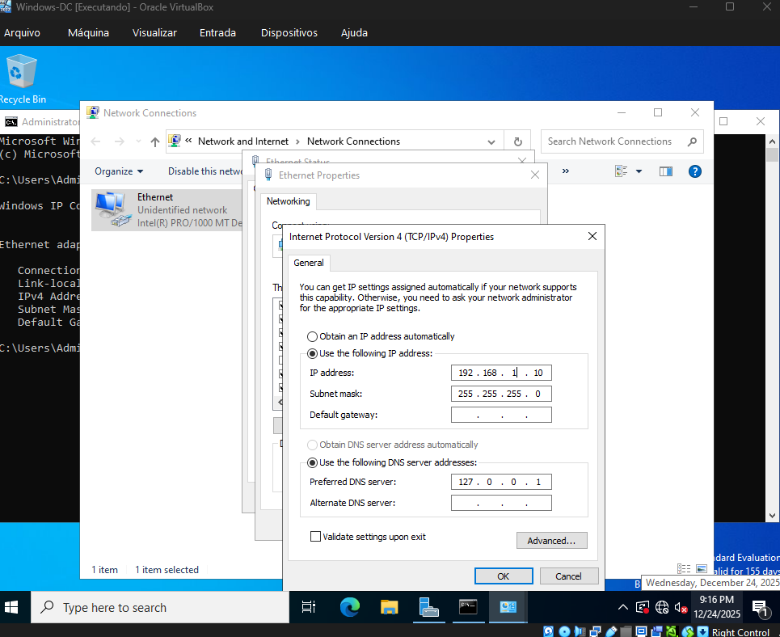
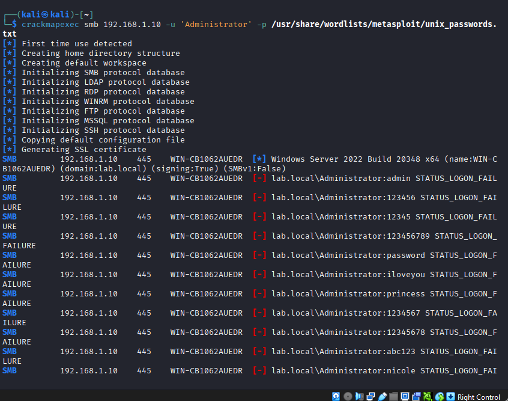
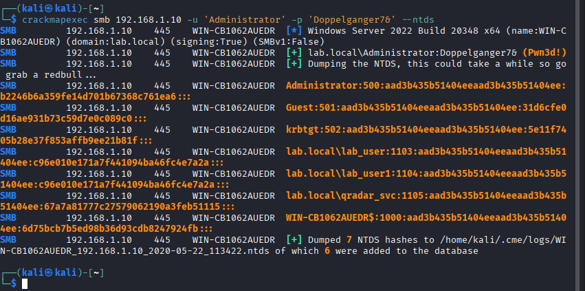
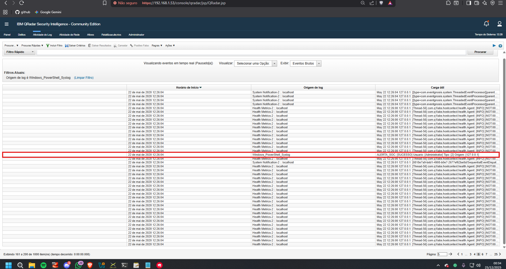

# AD Attack & Defense: Simulação e Detecção no QRadar 🛡️⚔️

Laboratório focado em emular um ambiente corporativo de Active Directory (AD) para execução de ataques de identidade e desenvolvimento de engenharia de detecção no **IBM QRadar**. O foco principal foi o bypass de detecções padrão e a criação de visibilidade sobre movimentação lateral.

## Stack Técnica
* **Atacante:** Kali Linux (Nmap, CrackMapExec, Impacket Suite).
* **Alvo:** Windows Server 2022 (Domain Controller).
* **SIEM:** IBM QRadar (Centralização e Correlação).
* **Protocolos:** SMB, NTLM, Kerberos e RPC.

---

## 🚀 1. Setup de Infraestrutura (Blue Team)
Antes dos testes, preparei o ambiente para garantir que nenhum rastro fosse perdido pelo SIEM:

* **Conta de Serviço:** Criação do usuário `qradar_svc` com permissões específicas para leitura de logs de segurança no DC.
* **Persistência:** Fixação de IP estático (`192.168.1.10`) no Domain Controller e validação de rotas entre o Kali e o SIEM via ICMP.

---

## ⚔️ 2. Ciclo de Ataque (Red Team)

### Reconhecimento e Força Bruta
Iniciei o mapeamento com Nmap focando em portas críticas (88/Kerberos, 445/SMB). Na sequência, simulei um ataque de dicionário via **CrackMapExec** contra o usuário `Administrator`. 

### Credential Dumping e Pass-the-Hash
Com acesso administrativo, realizei o dump da base **NTDS.dit** via Impacket, extraindo hashes de usuários sensíveis como o `krbtgt`. 
Utilizei a técnica de **Pass-the-Hash (T1550.002)** para movimentação lateral, comprovando que a complexidade da senha é irrelevante uma vez que o hash NTLM é obtido.

---

## 🛡️ 3. Engenharia de Detecção

### Visibilidade e Alertas
No QRadar, correlacionei os eventos de falha de login (Event ID 4625) para identificar o brute force. 

Um ponto crítico foi o **Logon Type 3** (Network Logon). Identifiquei que logons via Pass-the-Hash geram estruturas XML diferentes. Desenvolvi um parser em PowerShell para tratar esses campos e garantir que o QRadar alertasse corretamente sobre logins administrativos via rede.

---

## 🛠️ 4. Troubleshooting (Onde o bicho pegou)

* **Clock Skew (Erro 0xc000006d):** O AD barrava a autenticação porque o relógio do Kali e do DC estavam desalinhados. Precisei forçar o ajuste manual de data para maio de 2020 (alinhado à licença do QRadar) e desativar o sync de tempo do VirtualBox.
* **UAC e Filtro de Token:** O dumping via Impacket falhava inicialmente. Precisei ajustar a chave `LocalAccountTokenFilterPolicy` no registro do Windows para permitir que a conta administrativa remota tivesse o token de privilégio completo.
* **Falso Negativo no Parsing:** O script de coleta original ignorava logins de rede. A solução foi refazer a lógica de captura focando no objeto XML direto do Event Viewer, onde os detalhes do IP de origem e método de autenticação estavam "escondidos".

---

## 🎯 Mapeamento MITRE ATT&CK
* **T1046:** Network Service Scanning
* **T1110.001:** Password Brute Force
* **T1003.003:** OS Credential Dumping (NTDS)
* **T1550.002:** Lateral Movement (Pass-the-Hash)

---
*Projeto em Blue Team Operations.*
